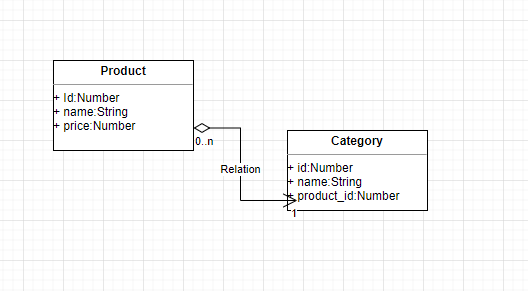

<h1>Desafio 3 Seed(Back-End)</h1>

<h2>UML</h2>

<h2>Desafio:</h2> https://substantial-letter-274.notion.site/Desafio-Back-end-41cb57f8b33040d5bc4e9da1d84363dc

<h2>AdonisJS:</h2> https://docs.adonisjs.com/guides/introduction

<h2>Testadas usando:</h2> https://insomnia.rest/ 
 
